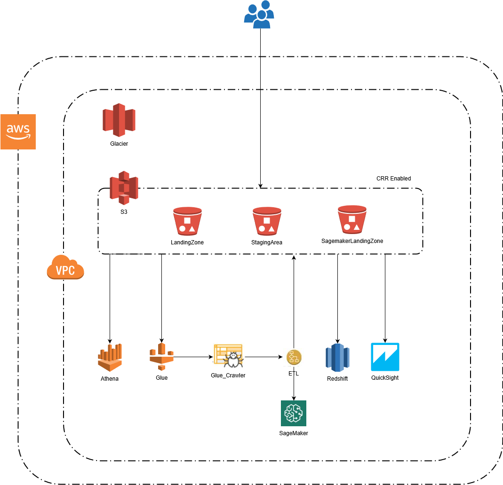

# Forest Wildfire Analytics w/ AWS Cloud
Wildfires can cause devastating destruction and cost millions of dollars in damage, especially with increasing human development near wilderness or rural areas. The ability to predict wildfires would be a preemptive measure to prevent and/or manage wildfires. Factors affecting wildfires would be explored and used to gauge the probability of a wildfire occurring. Based on the location and the corresponding land type, a machine learning model will be trained to identify the major contributing factors of the fire. For this project, we will be utilizing AWS Cloud to design a machine learning workflow that is flexible, robust, and automated.

## Team Information
**University**: [San Jose State University](http://www.sjsu.edu/)
**Course**: [Big Data Engineering and Analytics](http://info.sjsu.edu/web-dbgen/catalog/courses/CMPE266.html)
**Professor**: Sanjay Garje
**Students**: Kevin Chuang, Anna Chow, Hemang Behl, Jason Gonsalves, Richita Das  

## Architecture

##  Technologies
- AWS Technologies
  - AWS S3, AWS Glue, AWS Lambda, AWS Quicksight, AWS SageMaker, AWS Athena, AWS Redshift, AWS CloudWatch Logs
- Local Configuration
  - Python & Jupyter notebook (numpy, sklearn, scipy, matplotlib, Flask, boto3)

## Set up
- Download the source data file
- Script to convert the data file into a csv format
- Create the Lambda function [in Python 3.6] along with the Glue Crawler and Job [Spark instance in Python]
- Create a Redshift cluster with incoming connections open with appropriate IAM role to connect with Lambda and Glue
- Configure the SNS event to trigger upon file creation in the source bucket
- Upload the CSV file in to the source S3 bucket to trigger the Lambda function
- Data is loaded into Redshift automatically using the COPY command [appends data to store the historical view]
- AWS Glue job performs ETL on the raw csv file and places it in the destination bucket
- Using SageMaker notebook and SageMaker Python SDK, develop a model and train the model on the curated data from AWS Glue
- Using SageMaker endpoints to deploy the trained model to production.
  - Training model creates and stores model artifacts in an S3 bucket
- SageMaker Endpoint provides a hosted machine learning model, which can be accessed using basic API calls
- Athena uses Glue crawlers to query the raw and processed CSV files in real-time
- Quicksight is used to visualize and explore the data, as well as create informative data analytics dashboards
